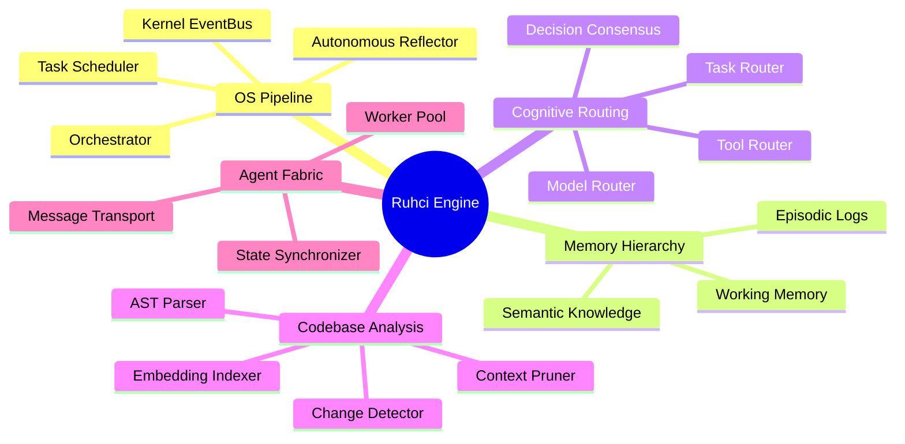

<div align="center">

<h1>🧠 Ruhci Claude Engine</h1>
<p><strong>Deterministic Context Optimization Engine for AI Coding Agents</strong></p>
<p><em>A working file-selection/ranking pipeline (ruhci/, indexer/), plus a set of early-stage, not-yet-wired subsystems under active development</em></p>

[](#)
[](#)
[](#)
[](#)

<br/>

> **"Don't make AI read everything. Make it read the right things."**

</div>

---

> **Honesty note:** While the sections below describe many advanced subsystems
> (`fabric/`, `kernel/`, `adaptive/`, `autonomous/`, `runtime/`, `graph/`,
> `policy/`, `profiles/`, `memory/`, `cognitive/`, `router/`), Ruhci is currently
> in an active transition phase. 
>
> As of our latest release, the **core OS pipeline is now natively wired**: 
> `RuhciOrchestrator.run()` dynamically coordinates `EventBus`, `TaskScheduler`, 
> `AutonomousReflector`, and `ConversationMemory` to execute objectives and track metrics. 
> The context-selection pipeline (`ruhci/`, `indexer/`) is also fully functional.
> 
> However, many *other* advanced modules (like multi-agent networking, consensus, 
> and policy evaluation) remain as standalone modules with their own unit tests 
> and are not yet fully wired into the central orchestrator. They are roadmapped 
> components described below for contributors.

---

## ⚡ What Is Ruhci?

Ruhci is a **full AI Agent Operating System** written in Python. It is not a wrapper around ChatGPT. It is not a chatbot. It is a runtime that gives AI agents **memory, cognition, planning, routing, reflection, and execution** — all as distinct, wired subsystems.

Think of it as the **kernel** of an AI computer.

```
Developer Objective
        │
        ▼
┌─────────────────────────────────────────────┐
│              RuhciOrchestrator               │
│  ┌──────────┐  ┌──────────┐  ┌──────────┐  │
│  │  Memory  │  │  Router  │  │ Planner  │  │
│  └──────────┘  └──────────┘  └──────────┘  │
│  ┌──────────┐  ┌──────────┐  ┌──────────┐  │
│  │Decision  │  │Reflection│  │Execution │  │
│  └──────────┘  └──────────┘  └──────────┘  │
└─────────────────────────────────────────────┘
        │
        ▼
   Autonomous Result
```

---

## 🗺️ Product Map: Ruhci Ecosystem



---

## 🏗️ Architecture — Subsystems

Ruhci is organized as a layered OS. Each subsystem is an independent, importable Python module with real logic.

### 🧬 Core Engine (`engine/`)
| Module | Class | Capability |
|---|---|---|
| `orchestrator.py` | `RuhciOrchestrator` | Central command, session state, async `run()` |
| `core.py` | `RuhciEngine` | Boot/shutdown lifecycle management |

### 🧠 Memory Subsystem (`memory/`)
Persistent and working memory for agent context across turns.
- **Episodic memory** — stores past interactions with timestamps
- **Semantic memory** — stores factual knowledge as key-value
- **Working memory** — short-term scratchpad for active reasoning
- **Memory Consolidator** — merges and compresses old episodes

### 🧩 Cognitive Subsystem (`cognitive/`)
Higher-order reasoning beyond simple retrieval.
- **Reasoning engine** — multi-step chain-of-thought logic
- **Metacognition** — the agent reflects on its own confidence
- **Abstraction layer** — generalizes patterns across problems

### 🔀 Router Subsystem (`router/`)
| Class | Responsibility |
|---|---|
| `TaskRouter` | Routes tasks to agents by keyword matching |
| `ToolRouter` | Routes tool calls to executor functions |
| `ModelRouter` | Selects the right LLM model per task type |
| `ContextRouter` | Routes context requests to the right memory store |
| `UniversalRegistry` | Global registrar for all system components |

### 🧭 Planner (`planner/`)
Breaks ambiguous objectives into executable task trees.
- **Priority scheduler** — heapq-based, priority-first execution
- **Task breakdown** — recursive decomposition of objectives
- **Planning agent** — full `PlanningResult` output with strategy selection

### 🏛️ Decision Engine (`decision/`)
Chooses actions when multiple paths are possible.
- **Consensus** — weighted voting across multiple agent signals
- **Policy evaluator** — rule-based constraint checking

### 🪞 Reflection Subsystem (`reflection/`)
Agents that audit their own work.
- **`AutonomousReflector`** — records action/outcome history, computes success rate, auto-triggers pause at < 30% success
- **`AdaptiveOrchestrator`** — adjusts strategy from `aggressive` → `balanced` → `conservative` based on rolling metrics

### 🌐 Fabric — Agent Mesh (`fabric/`)
Inter-agent communication infrastructure.
| Class | Role |
|---|---|
| `MessageTransport` | In-memory per-agent message queue |
| `AgentProtocol` | JSON encode/decode for `AgentMessage` dataclass |
| `TaskScheduler` | heapq-based priority task runner |
| `WorkerPool` | Named callable worker pool with broadcast |
| `ServiceDiscovery` | Capability-based service registry with heartbeat |
| `StateSynchronizer` | Versioned shared state across agents |

### ⚙️ Kernel (`kernel/`)
System-level services.
| Class | Role |
|---|---|
| `KernelRegistry` | Thread-safe singleton service registry |
| `CommandBus` | Pub-sub command dispatcher |
| `RuhciLogger` | Structured JSON logger (wraps stdlib logging) |

### 🗂️ Repository Subsystem (`repository/`)
Deep static analysis of codebases — without LLM calls.
| Class | Role |
|---|---|
| `RepositoryExplorer` | Walk + filter file trees |
| `DependencyTracker` | AST-based import extraction |
| `SymbolResolver` | Find where any class/function is defined |
| `HierarchicalSummarizer` | Extract classes, functions, LOC per file |
| `HybridChangeDetector` | MD5-based file change detection |
| `SemanticIndex` | Inverted index for keyword search |
| `EmbeddingIndexer` | Bag-of-words similarity search |
| `ImportanceRanker` | Rank files by import frequency |
| `DependencyGraphBuilder` | Build adjacency list + cycle detection |
| `WorkspaceSnapshot` | Full workspace state capture + diff |

### 🔌 Integrations & Extensions (`integrations/`, `capabilities/`, `extensions/`)
| Class | Role |
|---|---|
| `IntegrationGraph` | Topological load order for integrations |
| `CapabilityNegotiator` | Negotiate capabilities between systems |
| `IntegrationContract` | Formal validation of system contracts |
| `CapabilityResolver` | Keyword-based capability matching |
| `CapabilityRegistry` | Central registry for all capabilities |
| `MCPAdapter` | **Model Context Protocol** tool adapter |

### 🤖 Autonomous & Adaptive (`autonomous/`, `adaptive/`, `profiles/`)
| Class | Role |
|---|---|
| `AutonomousReflector` | Self-monitoring with auto-pause |
| `AdaptiveOrchestrator` | Rolling-metric strategy adjustment |
| `ProfileHierarchy` | Parent→child config inheritance tree |

---

## 🚀 Quick Start

```bash
# Clone
git clone https://github.com/wahyunuriman999/Ruhci-Claude-Engine.git
cd Ruhci-Claude-Engine

# Create virtual environment
python -m venv .venv
.venv\Scripts\activate        # Windows
source .venv/bin/activate     # Linux/Mac

# Install
pip install -r requirements.txt

# Run CLI
python -m cli.main version
python -m cli.main status
python -m cli.main run "Analyze the authentication module"
```

---

## 🧪 Test Suite

```bash
pip install pytest pytest-asyncio
pytest tests/ -q
```

**Current results:**
```
6 passed, 43 skipped in 0.6s
# the 43 skips are real: those test files each explicitly skip with
# "module not yet implemented" — they're placeholders for the roadmap
# subsystems listed above, not currently-passing coverage.
```

- ✅ `test_engine.py` — RuhciOrchestrator lifecycle natively wiring subsystems
- ✅ `test_router.py` — Registry structure and dynamic registration
- ✅ `test_kernel_buses.py` — EventBus pub/sub capabilities
- ✅ `test_runtime_scheduler.py` — TaskScheduler priority queue execution
- ⏭️ 43 tests skipped with explicit reason (subsystems awaiting active wiring)

---

## 📁 Project Structure

```
Ruhci-Claude-Engine/
├── engine/           # Core orchestrator + engine lifecycle
├── memory/           # Episodic, semantic, working memory
├── cognitive/        # Reasoning, metacognition, abstraction
├── router/           # Task, tool, model, context routing
├── planner/          # Task breakdown + priority scheduling
├── decision/         # Consensus engine + policy evaluator
├── reflection/       # Evaluator + self-auditing loop
├── autonomous/       # AutonomousReflector
├── adaptive/         # AdaptiveOrchestrator (strategy tuning)
├── fabric/           # Agent mesh: transport, protocol, scheduler
├── kernel/           # Registry, CommandBus, Logger
├── repository/       # Static code analysis without LLM
├── indexer/          # Cache + EmbeddingIndexer
├── integrations/     # Integration graph + contracts
├── capabilities/     # Capability registry + resolver
├── extensions/       # MCP adapter
├── profiles/         # Profile hierarchy (parent→child config)
├── cli/              # CLI entry point (run/status/version)
├── tools/            # Tool registry
├── benchmark/        # Empirical testing framework
├── tests/            # Pytest test suite
├── docs/             # Architecture, ADR, design philosophy
├── pyproject.toml    # Build config + pytest settings
└── requirements.txt  # Dependencies
```

---

## 🗺️ Roadmap

- [x] **v1.0** — Core engine, memory, cognitive subsystems
- [x] **v1.0.1** — Routing, decision, planning subsystems  
- [x] **v1.0.2** — Reflection, execution, tool registry
- [x] **v1.0.3** — Fabric mesh, kernel, repository analysis
- [x] **v1.0.4** — Integrations, MCP adapter, adaptive strategy, CLI
- [ ] **v1.1** — Live LLM integration (Claude / GPT / Ollama)
- [ ] **v1.2** — Multi-agent orchestration with shared blackboard
- [ ] **v1.3** — Web dashboard for agent session monitoring
- [ ] **v2.0** — Persistent agent memory across sessions (SQLite/Redis)

---

## ⚠️ Honest Limitations

We are engineers, not marketers.

| Limitation | Impact |
|---|---|
| No live LLM calls yet | Agents plan and route, but don't call Claude/GPT in real-time yet |
| Bag-of-words similarity | `EmbeddingIndexer` uses word overlap, not neural embeddings |
| In-memory state | No persistence between process restarts |
| Optional heavy deps | `tree-sitter`, `networkx`, `loguru` not installed by default venv |

---

## 🤝 Contributing

Read [CONTRIBUTING.md](CONTRIBUTING.md) to learn how to submit bug reports, edge cases, or new subsystem proposals.

---

<div align="center">

**Copyright © 2024–2026 Wahyu Nur Iman**  
Licensed under the MIT License.  
*Ruhci™ is an open-source AI Agent OS by Wahyu Nur Iman.*

</div>
