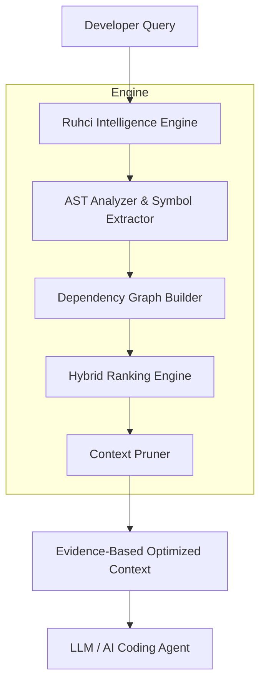

<div align="center">
  <h1 align="center">Ruhci Engine v1.0</h1>
  <p align="center"><strong>Deterministic Context Intelligence Engine</strong></p>
  <p><em>Repository Intelligence Layer for AI Coding Agents</em></p>

  <p><strong>Don't make AI read everything. Make it read the right things.</strong></p>

  [](#)
  [](#)
</div>

<br>

> **280,000 tokens of code. One bug.**
> 
> Traditional AI: *"Read everything."*
> 
> Ruhci: *"Find the evidence first."*

---

## ⚡ Why Ruhci Exists

Modern LLMs can read millions of tokens. **That doesn't mean they should.**

Feeding an AI hundreds of thousands of tokens of raw repository files introduces:
- 💸 **Exorbitant Cost**
- 🐢 **High Latency**
- 🌪️ **Extreme Attention Noise**
- 📉 **Lost-in-the-Middle Failures**

Ruhci solves this by acting as a **surgical pre-filter**. It retrieves only evidence-backed code before the LLM begins reasoning.

### The Pipeline

**❌ Without Ruhci (Brute-Force Context)**
`Developer` ➔ `Claude` ➔ `280,000+ tokens` ➔ 💸 ➔ `Slow & Noisy`

**✅ With Ruhci (Evidence-Backed Context)**
`Developer` ➔ `Ruhci` ➔ `~3,800 tokens` ➔ `Claude` ➔ ⚡ ➔ `Fast, Cheap & Sharp`

---

## 🚀 Quick Start (30 Seconds)

Get your optimized context instantly.

```bash
# 1. Clone & Install
git clone https://github.com/wahyunuriman999/Ruhci-Claude-Engine.git
cd Ruhci-Claude-Engine
pip install -r requirements.txt

# 2. Ask a question about any local repository
python ruhci_ask.py "Fix JWT refresh token expiration bug" --repo /path/to/repo

# 3. Done. Ruhci passes the 3 most relevant files to standard Claude.
```

---

## 🔍 Real Demo: End-to-End

**Developer asks:**
> *"How is the application context managed and pushed to the stack in Flask?"*

**Ruhci analyzes:**
1. **Candidate Selection**: Extracts symbols and TF-IDF semantics.
2. **Dependency Graph**: Maps AST imports.
3. **Intent Classification**: Detects *Structural* intent.
4. **Ranking & Pruning**: Isolates hub files.

**Claude receives only 4 files:**
- `globals.py`
- `helpers.py`
- `ctx.py`
- `sansio/app.py`

**Problem solved.** Zero LLM API calls were used to find these files.

---

## 📊 Empirical Validation (v1.0)

Ruhci has been empirically tested on massive real-world codebases (`requests`, `flask`, `urllib3`). 

```text
Performance Summary (Empirical Test 003)
━━━━━━━━━━━━━━━━━━━━━━━━━━━━━━━━━━━━
Average Token Reduction
████████████████████████ 98.6%
━━━━━━━━━━━━━━━━━━━━━━━━━━━━━━━━━━━━
Average Cost Reduction
████████████████████████ 98.6%
━━━━━━━━━━━━━━━━━━━━━━━━━━━━━━━━━━━━
Structural Dominance Anomalies
███ 1 (Exceptions.py in Requests)
━━━━━━━━━━━━━━━━━━━━━━━━━━━━━━━━━━━━
```
*(Based on Empirical Test 003: Flask, Requests, and Urllib3).*

**Real-World Honesty (The Structural Dominance Anomaly):**  
When queried *"How does SSL certificate verification work?"* on `requests`, Ruhci successfully boosted `adapters.py` and `sessions.py` to the top 3 using semantics. However, `exceptions.py` stole the #1 spot purely due to its massive dependency score (it is imported everywhere). 

**Conclusion**: Downstream AI agents should consume Ruhci's output via a **Top-N approach** (e.g., Top 5) rather than a hard threshold score cutoff, ensuring that highly relevant semantic files are not accidentally truncated behind structurally dominant utility files.

---

## ⚙️ How It Works (Architecture)

Ruhci analyzes source code *without* relying on expensive LLM vector embeddings. It builds a precise, structural map of your codebase.



### 1. Deterministic Repository Understanding
- Pure AST (Abstract Syntax Tree) parsing
- Exhaustive symbol extraction (functions, classes, variables)
- Deep import relationship analysis

### 2. Hybrid Intelligence Ranking
- **Symbol Evidence**: Exact structural matches.
- **Dependency Relevance**: Is this file required by the primary target?
- **Semantic Similarity**: TF-IDF emulation.
- **Intent Classification**: Lexical heuristics to detect if the user is debugging, refactoring, or learning.

---

## 🔌 Integration with AI Agents

Ruhci is designed to be pipeline-agnostic. You can pipe its output directly into your favorite tools:
- **Claude Code** (Default)
- **free-claude-code** (Opt-in)
- **Ollama** (100% Local)
- **Cursor** / **Continue.dev**

**Execute the complete pipeline locally:**
```bash
# Route to standard Claude (Default)
python ruhci_ask.py "How does SSL work?" --repo /path/to/repo

# Route to Ollama (100% Local & Free)
python ruhci_ask.py "How does SSL work?" --repo /path/to/repo --agent ollama

# Route to community proxy
python ruhci_ask.py "How does SSL work?" --repo /path/to/repo --agent free-claude-code
```
> **Disclaimer**: Standard `claude` requires authentication. You can explicitly pass `--agent free-claude-code` to route to a third-party community proxy. Please review their repository and respect upstream terms of service before using third-party proxies.

---

## 🛑 What Ruhci Is Not

Before using Ruhci, it is important to understand what it is not. We are engineers, not marketers.

❌ A replacement for Claude, GPT, or Gemini  
❌ An autonomous coding agent  
❌ A magic fuzzy search engine or True NLP  

**Ruhci IS:**  
✓ A deterministic context optimization layer  
✓ An evidence extraction system  
✓ A strict, fast bridge between massive software repositories and AI models  

---

## ⚠️ Limitations & Known Edge Cases (Brutally Honest)

As a deterministic system based on TF-IDF and AST (without Vector Embeddings or Machine Learning), Ruhci has inherent limitations:

- **Heuristic Intent Detection**: The `QueryIntentClassifier` relies entirely on lexical heuristics (e.g., matching the phrase "how to" to determine Usage intent). It is not true NLP and cannot understand nuanced or implicitly phrased intents.
- **Structural Dominance**: Files with high dependency in-degrees (like `exceptions.py` or base classes) can accumulate massive scores and dominate the #1 rank, occasionally overshadowing files that are more semantically relevant to the specific query.
- **Substring Match False Positives**: For very short query terms (like `ssl`, `jwt`, `db`), bidirectional substring matching (`term in token or token in term`) can trigger false positives (e.g., `ssl` will match a variable named `sesslink`).
- **Semantic Gap**: Cannot recognize conceptual synonyms (e.g., "TLS handshake" will not catch files containing the word "SSL" if there is no string overlap at all).
- **Abbreviation Mismatch**: Developers might use abbreviations in code (e.g., `jwt`), while the user asks with the full words ("JSON Web Token"). Ruhci will not find a match without embeddings.

Therefore, Ruhci is positioned as an **efficient structural complement** to Vector RAG systems and a pre-filter for LLMs, not an absolute replacement.

---

## 🗺️ Roadmap

- [x] **v0.3** - Functional Research Preview (End-to-End AST Pipeline)
- [x] **v0.4** - Vector-Semantic Pre-filtering & Content Search
- [x] **v0.6** - Semantic Calibration & Edge Case Mitigation
- [x] **v0.7** - Intent Dynamics & Lexical Analytics
- [x] **v1.0** - Production Engine Release
- [ ] **v1.x** - Multi-Language Support (JS/TS, Go, Rust)

---

## 🤝 Contributing

We actively invite you to try and break our benchmark. If you find edge cases where Ruhci fails to retrieve the correct context, please submit them!

Read our [Community Benchmark Guidelines](benchmark/community/README.md) to submit a failure case.

---
**Copyright © 2026 Wahyu Nur Iman**  
Licensed under the MIT License.  
*Ruhci™ is a project by Wahyu Nur Iman.*
