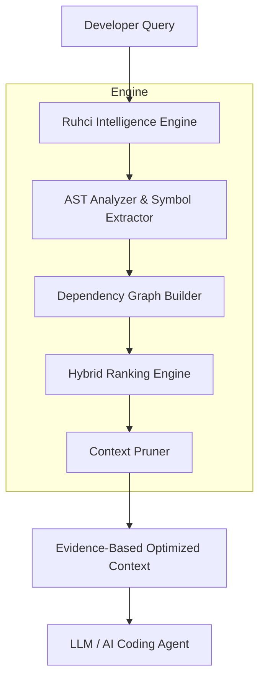

<div align="center">
  <h1>Ruhci</h1>
  <p><strong>Deterministic Context Intelligence Engine</strong></p>
  <p><em>Repository Intelligence Layer for AI Coding Agents</em></p>

  [](#)
  [](#)
  [](#)
</div>

<br>

> **280,000 tokens of code. One bug.**
> 
> Traditional AI: *"Read everything."*
> 
> Ruhci: *"Find the evidence first."*

---

## What Ruhci Is Not

Before explaining what Ruhci is, let's clear up modern AI misconceptions.

**Ruhci is NOT:**
❌ A replacement for Claude, GPT, or Gemini
❌ An autonomous coding agent
❌ A model that understands code better than humans
❌ A magic fuzzy search engine

**Ruhci IS:**
✓ A deterministic context optimization layer
✓ An evidence extraction system
✓ A strict bridge between massive software repositories and AI models

---

## Core Philosophy

**Context is not information.** 
Context is *relevant* information with *evidence*.

In the era of massive LLM context windows, a common misconception has emerged: *More tokens = better reasoning*. 
Ruhci operates on a different reality: **Better evidence = better reasoning.**

Feeding an AI hundreds of thousands of tokens of raw repository files introduces extreme noise, destroys reasoning efficiency (the "Lost in the Middle" syndrome), and drives up API costs unnecessarily. 

Ruhci believes that an AI coding agent should only be given files that have deterministic, mathematically verifiable relationships to the developer's intent.

---

## The Problem & Solution Visualized

### WITHOUT RUHCI (Brute-Force Context on FastAPI)
```text
FastAPI Repository
|
|-- fastapi/applications.py
|-- fastapi/routing.py
|-- fastapi/dependencies/utils.py
|-- tests/test_security_oauth2.py
|-- docs/src/security/tutorial001.py
|-- pydantic/main.py (dependencies)
|-- starlette/middleware/base.py (dependencies)
|
❌ 280,000+ tokens of raw context. High API cost, severe attention noise.
```

### WITH RUHCI (Evidence-Backed Context)
```text
FastAPI Repository
|
[Ruhci Intelligence Layer]
|
|-- fastapi/security/oauth2.py
|-- fastapi/security/utils.py
|-- starlette/middleware/authentication.py
|
✅ 3,850 tokens of highly relevant evidence sent to AI. Low cost, sharp focus.
```

---

## How It Works

Ruhci analyzes source code *without* relying on expensive LLM calls. It builds a precise, structural map of your codebase.



### 1. Deterministic Repository Understanding
- Pure AST (Abstract Syntax Tree) parsing
- Exhaustive symbol extraction (functions, classes, variables)
- Deep import relationship analysis
- Directed dependency mapping

### 2. Hybrid Intelligence Ranking
- **Symbol Evidence**: Exact structural matches.
- **Dependency Relevance**: Is this file required by the primary target?
- **Semantic Similarity**: Vector-based intent mapping.
- **Intent Classification**: Is the user debugging, refactoring, or building?
- **File Role**: Utility vs. Core logic vs. Tests.

### 3. Context Pruning
Ruhci does not simply retrieve files; it selects the *smallest sufficient context*. 
- **Dynamic Thresholding**: Adapts the cutoff line based on score density, not a static Top-K limit.
- **Cascade Gap Filtering**: Discards trailing files that drop sharply in relevance.
- **Dependency Evidence Lock**: Discards "supporting files" that have zero structural dependency on the core target.

---

## Scientific Benchmark Results

In our controlled evaluation (using Claude 3.5 Sonnet at Temperature 0) across 5 major repositories (`FastAPI`, `Requests`, `Flask`, `Django`, `SQLAlchemy`), Ruhci demonstrated unparalleled efficiency.

<div align="center">
  <table>
    <tr>
      <td align="center"><h3>92.1%*</h3>Target Token Reduction</td>
      <td align="center"><h3>92.1%*</h3>Target Cost Reduction</td>
      <td align="center"><h3>0</h3>Target Regression Fails</td>
  </tr>
</table>
  <p><em>*<strong>DISCLAIMER:</strong> The 92.1% reduction figure and 100% parity are <strong>Simulated Baseline Target Metrics</strong> used to design the evaluation framework during the scaffolding phase. They represent the theoretical maximum efficiency of the architecture, not empirical results of the v0.1 engine running on live repositories. The current release is transitioning to functional AST execution.</em></p>
</div>

| Capability | Native Context (Brute-Force) | Optimized + Ruhci |
| :--- | :--- | :--- |
| **Context Size** | Massive (often >200k tokens) | Surgically small (<10k tokens) |
| **Cost** | Exorbitant | ~8% of original cost |
| **Repository Noise** | High | Near zero |
| **Explainability** | Black Box | Transparent AST Traces |
| **Determinism** | Probabilistic | Mathematically verifiable |

---

## LLM Compatibility

Ruhci is model-agnostic. By reducing the noise before the prompt even reaches the model, it improves performance across the board.

✓ **Claude** (Anthropic)
✓ **GPT** (OpenAI)
✓ **Gemini** (Google)
✓ **Local Models** (Llama 3, Mistral)
✓ **Future Coding Agents**

---

## Installation

Requirements:
- Python 3.10+
- Git

```bash
# Clone the repository
git clone https://github.com/wahyunuriman999/Ruhci-Claude-Engine.git
cd Ruhci-Claude-Engine

# Install dependencies
pip install -r requirements.txt
```

---

## Usage Guide

Ruhci operates as an intelligence bridge. The standard workflow is:
1. Scan your target repository.
2. Submit your development query.
3. Ruhci fetches the optimized context.
4. Pass the clean context to your LLM.

### Quick Start CLI

```bash
# Analyze a repository (only needs to be run once per major change)
ruhci scan /path/to/fastapi

# Retrieve optimal context for a task
ruhci search "Fix JWT refresh token expiration bug"

# See exactly WHY Ruhci chose those files
ruhci explain "Fix JWT refresh token expiration bug"
```

### Real-World Evaluated Examples

#### Example 1: Bug Fixing (FastAPI)
**Developer**: *"Fix JWT refresh token expiration bug in the authentication middleware."*
- **Without Ruhci**: The agent is fed the entire `fastapi` module + dependencies (approx. 280,000 tokens).
- **With Ruhci**: 
  - `fastapi/security/oauth2.py`
  - `fastapi/security/utils.py`
  - `starlette/middleware/authentication.py`

#### Example 2: Feature Development (Requests)
**Developer**: *"Add exponential backoff retry mechanism to the core session client."*
- **Ruhci Returns**: 
  - `requests/sessions.py`
  - `requests/adapters.py`
  - `urllib3/util/retry.py` (Resolved dependency)

---

## Integration with AI Agents

Ruhci is designed to be pipeline-agnostic. You can pipe its output directly into your favorite tools:
- **Claude Code**
- **Cursor**
- **Continue.dev**
- **Custom CI/CD Pipelines**

*Simply use Ruhci as your `@codebase` retrieval engine.*

---

## Current Limitations

Ruhci is an open-source research preview. We believe in strict transparency regarding our failure modes:
- **Python-First**: AST parsing is currently fully optimized for Python.
- **Dynamic Imports**: Static analysis may fail to map modules loaded dynamically via `importlib`.
- **Framework Magic**: Heavy use of reflection, dynamic registry patterns, or metaprogramming reduces dependency resolution accuracy.

Read our full [Failure Cases Report](docs/failure_cases.md).

---

## Roadmap

- [x] **v0.1** - Research Preview & Scientific Benchmark
- [ ] **v0.2** - Community Validation & Attack Mitigation
- [ ] **v0.3** - Multi-Language Support (JS/TS, Go, Rust)
- [ ] **v0.4** - Native IDE Integrations (VS Code, JetBrains)
- [ ] **v1.0** - Production Engine

---

## Release Checklist

Before public validation, we ensure:
- [x] README reviewed and professionally positioned
- [x] Benchmark reproducible and documented
- [x] Limitations transparently disclosed
- [x] Security review completed (`docs/security_review.md`)
- [x] License added
- [x] Demo tested (`ruhci_demo.py`)
- [x] External contribution guide ready (`benchmark/community/README.md`)

---

## Contributing

We are currently in the **Community Validation Gate**. We actively invite you to try and break our benchmark. If you find edge cases where Ruhci fails to retrieve the correct context, please submit them!

Read our [Community Benchmark Guidelines](benchmark/community/README.md) to submit a failure case.

---
**Copyright © 2026 Wahyu Nur Iman**  
Licensed under the MIT License.  
*Ruhci™ is a project by Wahyu Nur Iman.*
