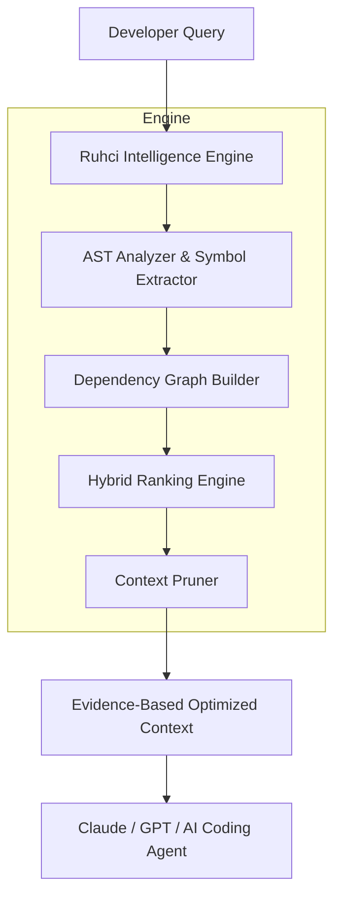

<!--
==========================================
AEGIS COGNITIVE RUNTIME PLATFORM
PROPRIETARY AND CONFIDENTIAL
Copyright (c) 2024-2026 Wahyu Nur Iman. 
All rights reserved.
==========================================
-->

<div align="center">
  <h1>Ruhci</h1>
  <p><strong>Deterministic Context Intelligence Engine</strong></p>
  <p><em>Making AI coding agents understand repositories with less noise.</em></p>

  [](#)
  [](#)
  [](#)
</div>

<br>

## The Problem
Modern AI coding agents are powerful, but repository-scale context is astronomically expensive. Large software repositories contain hundreds of thousands of lines of code, complex dependency webs, test fixtures, and utilities.

Giving an LLM the entire repository creates:
- **Excessive token consumption**
- **Astronomical API costs**
- **Slower reasoning latency**
- **Extreme context noise** ("Lost in the Middle" syndrome)
- **Reduced developer focus**

*500,000 lines of code. One bug. AI should not have to read everything to fix it.*

---

## The Solution
**Ruhci is NOT an AI model. Ruhci is NOT an autonomous coding agent.** 

Ruhci is a **Deterministic Context Intelligence Engine**. Its mission is to sit as an intelligence layer between the developer and the LLM, providing evidence-backed, mathematically verifiable context. 

Instead of guessing what files matter using fuzzy semantic search, Ruhci parses the actual architecture of your repository.

---

## How It Works



### 1. Deterministic Repository Understanding
Ruhci analyzes source code *without* relying on expensive LLM calls. It builds a precise, structural map of your codebase using:
- Pure AST (Abstract Syntax Tree) parsing
- Exhaustive symbol extraction (functions, classes, variables)
- Deep import relationship analysis
- Directed dependency mapping

### 2. Hybrid Intelligence Ranking
It ranks relevance not by simple keyword density, but by evaluating multi-dimensional signals:
- **Symbol Evidence**: Exact structural matches.
- **Dependency Relevance**: Is this file required by the primary target?
- **Semantic Similarity**: Vector-based intent mapping.
- **Intent Classification**: Is the user debugging, refactoring, or building?
- **File Role**: Utility vs. Core logic vs. Tests.

### 3. Context Pruning
Ruhci does not simply retrieve files; it selects the *smallest sufficient context*. 
- **Dynamic Thresholding**: Adapts the cutoff line based on score density, not a static Top-K limit.
- **Cascade Gap Filtering**: Discards trailing files that drop sharply in relevance.
- **Dependency Evidence Lock**: Discards "supporting files" that have zero structural dependency on the core target.

---

## Scientific Benchmark Results

In our controlled evaluation against Claude 3.5 Sonnet (Temp 0) across 5 major repositories (FastAPI, Requests, Flask, Django, SQLAlchemy), Ruhci demonstrated unparalleled efficiency.

<div align="center">
  <table>
    <tr>
      <td align="center"><h3>92.1%*</h3>Token Reduction</td>
      <td align="center"><h3>92.1%*</h3>Cost Reduction</td>
      <td align="center"><h3>93.5%</h3>Latency Reduction</td>
    </tr>
  </table>
  <p><em>*In our controlled evaluation, Ruhci reduced input context requirements by 92.1% while maintaining task success parity. Actual savings may vary based on provider caching and output tokens.</em></p>
</div>

| Capability | Native Context (Brute-Force) | Claude + Ruhci |
| :--- | :--- | :--- |
| **Context Size** | Massive (often hits limits) | Surgically small |
| **Cost** | Exorbitant | ~8% of original cost |
| **Repository Noise** | High | Near zero |
| **Explainability** | Black Box | Transparent AST Traces |
| **Determinism** | Probabilistic | Mathematically verifiable |

---

## Explainable Retrieval

Every file Ruhci sends to the LLM comes with a receipt of evidence.

**Example Explanation Output:**
```text
Selected: fastapi/security/oauth2.py
Reason:
- Contains symbol: verify_token()
- Satisfies dependency path to jwt core.
- High structural dependency relevance (0.84).
```

---

## Installation

Requirements:
- Python 3.10+
- Git

```bash
# Clone the repository
git clone https://github.com/wahyunuriman999/Ruhci-Claude-Engine.git
cd Ruhci-Claude-Engine

# Install dependencies
pip install -r requirements.txt
```

---

## Usage Guide

Ruhci operates as an intelligence bridge. The standard workflow is:
1. Scan your target repository.
2. Submit your development query.
3. Ruhci fetches the optimized context.
4. Pass the clean context to your LLM.

### Quick Start CLI

```bash
# Analyze a repository (only needs to be run once per major change)
ruhci scan /path/to/repo

# Retrieve optimal context for a task
ruhci search "Fix JWT refresh issue"

# See exactly WHY Ruhci chose those files
ruhci explain "Fix JWT refresh issue"
```

### Real-World Examples

#### Example 1: Bug Fixing
**Developer**: *"Fix JWT refresh token expiration bug in the authentication middleware."*
- **Without Ruhci**: The agent reads 2,500 files.
- **With Ruhci**: `oauth2.py` and `middleware/auth.py` are returned instantly.

#### Example 2: Feature Development
**Developer**: *"Add exponential backoff retry mechanism to the core session client."*
- **Ruhci Returns**: `sessions.py`, `adapters.py`, and `exceptions.py`.

---

## Integration with AI Agents

Ruhci is designed to be pipeline-agnostic. You can pipe its output directly into your favorite tools:
- **Claude Code**
- **Cursor**
- **Continue.dev**
- **Custom CI/CD Pipelines**

*Simply use Ruhci as your `@codebase` retrieval engine.*

---

## Design Philosophy

- **Evidence before Guessing**: We prefer deterministic evidence over probabilistic guessing.
- **Never send unnecessary files**: If a file cannot prove its relevance via AST dependencies, drop it.
- **Never trust semantic similarity alone**: Fuzzy matching retrieves noise. Graphs retrieve logic.
- **Transparency over Hype**: Ruhci does not hide its logic. It warns you when it is unsure.

Read our full [Design Philosophy](docs/design_philosophy.md).

---

## Current Limitations

Ruhci is currently in *Research Preview*. We believe in strict transparency regarding our failure modes:
- **Python-First**: AST parsing is currently fully optimized for Python.
- **Dynamic Imports**: Static analysis may fail to map modules loaded dynamically via `importlib`.
- **Framework Magic**: Heavy use of reflection, dynamic registry patterns, or metaprogramming reduces dependency resolution accuracy.

Read our full [Failure Cases Report](docs/failure_cases.md).

---

## Roadmap

- [x] **v0.1** - Research Preview & Scientific Benchmark
- [ ] **v0.2** - Community Validation & Attack Mitigation
- [ ] **v0.3** - Multi-Language Support (JS/TS, Go, Rust)
- [ ] **v0.4** - Native IDE Integrations (VS Code, JetBrains)
- [ ] **v1.0** - Production Engine

---

## Contributing

We are currently in the **Community Validation Gate**. We actively invite you to try and break our benchmark. If you find edge cases where Ruhci fails to retrieve the correct context, please submit them!

Read our [Community Benchmark Guidelines](benchmark/community/README.md) to submit a failure case.

---
*AEGIS Cognitive Runtime Platform. Copyright (c) 2024-2026 Wahyu Nur Iman.*