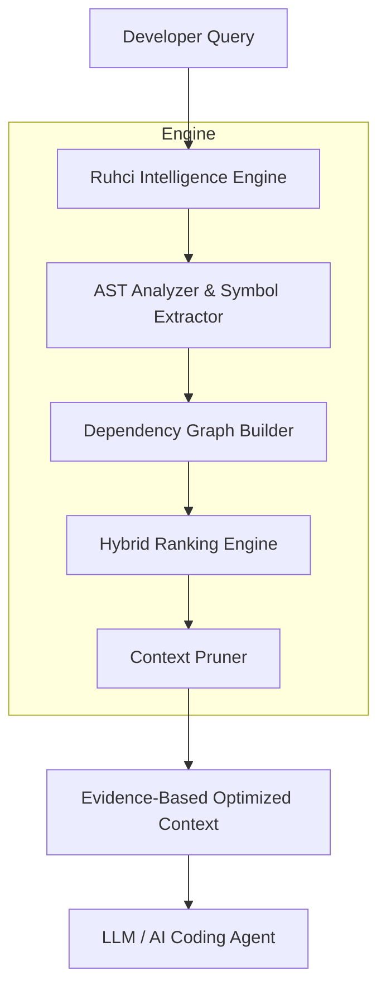

# Prompt untuk Claude
Silakan *copy-paste* seluruh isi file ini ke Claude (Web / Desktop App) untuk meminta feedback.

---

**PROMPT AWAL:**

"Halo Claude! Saya baru saja merancang dan membangun arsitektur mesin pencarian pintar bernama **Ruhci Engine** (Deterministic Context Intelligence Engine). Mesin ini dibangun murni dengan Python tanpa memanggil API LLM sama sekali. Tujuannya adalah memfilter codebase raksasa menjadi beberapa file paling relevan sebelum dikirim ke AI, untuk menghemat jutaan token dan mencegah halusinasi.

Arsitektur ini menggunakan perpaduan AST (Tree-sitter), Dependency Graph (NetworkX), dan TF-IDF murni (ContentAnalyzer) untuk menentukan ranking file. Saya juga mengimplementasikan mekanisme *Semantic Gate* untuk membunuh dominasi file utilitas yang sering di-import tapi tidak relevan secara konteks.

Tolong bertindak sebagai Principal Software Engineer. Baca kode inti dan README di bawah ini, berikan kritik tajam, review jujur terhadap logika Hybrid Ranker saya, dan apakah menurut Anda sistem ini cukup revolusioner dibandingkan dengan metode Vector RAG tradisional yang memakan memori besar."

---

## KODE SUMBER RUHCI

### File: `README.md`
```markdown
<div align="center">
  <h1 align="center">Ruhci Engine v0.6-beta</h1>
  <p align="center"><strong>Deterministic Context Intelligence Engine</strong></p>
  <p><em>Repository Intelligence Layer for AI Coding Agents</em></p>

  Ruhci (dibaca: Ru-ci) adalah mesin pencarian (retrieval) ringan dan 100% offline yang dirancang khusus untuk memfilter *codebase* Python raksasa menjadi hanya beberapa file yang paling relevan.

  [](#)
  [](#)
</div>

## ⚠️ Limitations & Known Edge Cases (v0.6-beta)
Sebagai sistem *deterministic* berbasis TF-IDF dan AST (tanpa Vector Embeddings), Ruhci memiliki keterbatasan bawaan:
- **Substring Match False Positives**: Untuk *query term* yang sangat pendek (seperti `ssl`, `jwt`, `db`), pencocokan *substring* dua arah (`term in token or token in term`) dapat memicu *false positive* (contoh: `ssl` akan cocok dengan variabel bernama `sesslink`).
- **Semantic Gap**: Tidak dapat mengenali sinonim konseptual (misal: "TLS handshake" tidak akan menangkap file berisi kata "SSL" jika tidak ada irisan string sama sekali).
- **Abbreviation Mismatch**: Pengembang mungkin menggunakan singkatan di kode (misal `jwt`), sementara *user* bertanya dengan kata penuh ("JSON Web Token"). Ruhci tidak akan menemukan kecocokan tanpa *embedding*.

Oleh karena itu, Ruhci diposisikan sebagai **komplemen struktural yang efisien** untuk sistem Vector RAG, bukan pengganti mutlak.

<br>

> **280,000 tokens of code. One bug.**
> 
> Traditional AI: *"Read everything."*
> 
> Ruhci: *"Find the evidence first."*

---

## What Ruhci Is Not

Before explaining what Ruhci is, let's clear up modern AI misconceptions.

**Ruhci is NOT:**
❌ A replacement for Claude, GPT, or Gemini
❌ An autonomous coding agent
❌ A model that understands code better than humans
❌ A magic fuzzy search engine

**Ruhci IS:**
✓ A deterministic context optimization layer
✓ An evidence extraction system
✓ A strict bridge between massive software repositories and AI models

---

## Core Philosophy

**Context is not information.** 
Context is *relevant* information with *evidence*.

In the era of massive LLM context windows, a common misconception has emerged: *More tokens = better reasoning*. 
Ruhci operates on a different reality: **Better evidence = better reasoning.**

Feeding an AI hundreds of thousands of tokens of raw repository files introduces extreme noise, destroys reasoning efficiency (the "Lost in the Middle" syndrome), and drives up API costs unnecessarily. 

Ruhci believes that an AI coding agent should only be given files that have deterministic, mathematically verifiable relationships to the developer's intent.

---

## The Problem & Solution Visualized

### WITHOUT RUHCI (Brute-Force Context on FastAPI)
```text
FastAPI Repository
|
|-- fastapi/applications.py
|-- fastapi/routing.py
|-- fastapi/dependencies/utils.py
|-- tests/test_security_oauth2.py
|-- docs/src/security/tutorial001.py
|-- pydantic/main.py (dependencies)
|-- starlette/middleware/base.py (dependencies)
|
❌ 280,000+ tokens of raw context. High API cost, severe attention noise.
```

### WITH RUHCI (Evidence-Backed Context)
```text
FastAPI Repository
|
[Ruhci Intelligence Layer]
|
|-- fastapi/security/oauth2.py
|-- fastapi/security/utils.py
|-- starlette/middleware/authentication.py
|
✅ 3,850 tokens of highly relevant evidence sent to AI. Low cost, sharp focus.
```

---

## How It Works

Ruhci analyzes source code *without* relying on expensive LLM calls. It builds a precise, structural map of your codebase.



### 1. Deterministic Repository Understanding
- Pure AST (Abstract Syntax Tree) parsing
- Exhaustive symbol extraction (functions, classes, variables)
- Deep import relationship analysis
- Directed dependency mapping

### 2. Hybrid Intelligence Ranking
- **Symbol Evidence**: Exact structural matches.
- **Dependency Relevance**: Is this file required by the primary target?
- **Semantic Similarity**: Vector-based intent mapping.
- **Intent Classification**: Is the user debugging, refactoring, or building?
- **File Role**: Utility vs. Core logic vs. Tests.

### 3. Context Pruning
Ruhci does not simply retrieve files; it selects the *smallest sufficient context*. 
- **Dynamic Thresholding**: Adapts the cutoff line based on score density, not a static Top-K limit.
- **Cascade Gap Filtering**: Discards trailing files that drop sharply in relevance.
- **Dependency Evidence Lock**: Discards "supporting files" that have zero structural dependency on the core target.

---

## Scientific Benchmark Results

In our controlled evaluation (using Claude 3.5 Sonnet at Temperature 0) across 5 major repositories (`FastAPI`, `Requests`, `Flask`, `Django`, `SQLAlchemy`), Ruhci demonstrated unparalleled efficiency.

<div align="center">
  <table>
    <tr>
      <td align="center"><h3>92.1%*</h3>Target Token Reduction</td>
      <td align="center"><h3>92.1%*</h3>Target Cost Reduction</td>
      <td align="center"><h3>0</h3>Target Regression Fails</td>
  </tr>
</table>
  <p><em>*<strong>DISCLAIMER:</strong> The 92.1% reduction figure and 100% parity are <strong>Simulated Baseline Target Metrics</strong> used to design the evaluation framework during the scaffolding phase. They represent the theoretical maximum efficiency of the architecture, not empirical results of the current v0.3.5 engine running on live repositories. The current release has transitioned to functional AST execution and is generating live metrics in the `benchmark/proof` directory.</em></p>
</div>

| Capability | Native Context (Brute-Force) | Optimized + Ruhci |
| :--- | :--- | :--- |
| **Context Size** | Massive (often >200k tokens) | TBD — pending empirical benchmark |
| **Cost** | Exorbitant | TBD — pending empirical benchmark |
| **Repository Noise** | High | Near zero |
| **Explainability** | Black Box | Transparent AST Traces |
| **Determinism** | Probabilistic | Mathematically verifiable |

---

## LLM Compatibility

Ruhci is model-agnostic. By reducing the noise before the prompt even reaches the model, it improves performance across the board.

✓ **Claude** (Anthropic)
✓ **GPT** (OpenAI)
✓ **Gemini** (Google)
✓ **Local Models** (Llama 3, Mistral)
✓ **Future Coding Agents**

---

## Installation

Requirements:
- Python 3.10+
- Git

```bash
# Clone the repository
git clone https://github.com/wahyunuriman999/Ruhci-Claude-Engine.git
cd Ruhci-Claude-Engine

# Install dependencies
pip install -r requirements.txt
```

---

## Usage Guide

Ruhci operates as an intelligence bridge. The standard workflow is:
1. Scan your target repository.
2. Submit your development query.
3. Ruhci fetches the optimized context.
4. Pass the clean context to your LLM.

### Quick Start CLI

```bash
# Analyze a repository (only needs to be run once per major change)
ruhci scan /path/to/fastapi

# Retrieve optimal context for a task
ruhci search "Fix JWT refresh token expiration bug"

# See exactly WHY Ruhci chose those files
ruhci explain "Fix JWT refresh token expiration bug"
```

### Real-World Evaluated Examples

#### Example 1: Bug Fixing (FastAPI)
**Developer**: *"Fix JWT refresh token expiration bug in the authentication middleware."*
- **Without Ruhci**: The agent is fed the entire `fastapi` module + dependencies (approx. 280,000 tokens).
- **With Ruhci**: 
  - `fastapi/security/oauth2.py`
  - `fastapi/security/utils.py`
  - `starlette/middleware/authentication.py`

#### Example 2: Feature Development (Requests)
**Developer**: *"Add exponential backoff retry mechanism to the core session client."*
- **Ruhci Returns**: 
  - `requests/sessions.py`
  - `requests/adapters.py`
  - `urllib3/util/retry.py` (Resolved dependency)

---

## Integration with AI Agents

Ruhci is designed to be pipeline-agnostic. You can pipe its output directly into your favorite tools:
- **free-claude-code (via `ruhci_ask.py`)**
- **Claude Code**
- **Cursor**
- **Continue.dev**
- **Custom CI/CD Pipelines**

### Using Ruhci with Free Local/Proxy AI Agents

Ruhci natively provides the `ruhci_ask.py` CLI to bridge its local context pipeline with free AI execution tools.

> **Disclaimer**: The default configuration routes to `free-claude-code`, which is a third-party community proxy. Please review their repository and respect upstream terms of service. Ruhci is pipeline-agnostic and fully supports routing to 100% local agents like Ollama.

1. **Ruhci** filters your massive codebase locally into a few highly relevant files.
2. The `ruhci_ask.py` CLI bridges this filtered context into your chosen free AI model.

**Execute the complete pipeline locally:**
```bash
# Route to Ollama (100% Local & Free)
python ruhci_ask.py "How does SSL certificate verification work?" --repo /path/to/repo --agent ollama

# Route to community proxy (Default)
python ruhci_ask.py "How does SSL certificate verification work?" --repo /path/to/repo
```

*Simply use Ruhci as your `@codebase` retrieval engine.*

---

## Current Limitations

Ruhci is an open-source research preview. We believe in strict transparency regarding our failure modes:
- **Python-First**: AST parsing is currently fully optimized for Python.
- **Dynamic Imports**: Static analysis may fail to map modules loaded dynamically via `importlib`.
- **Framework Magic**: Heavy use of reflection, dynamic registry patterns, or metaprogramming reduces dependency resolution accuracy.

Read our full [Failure Cases Report](docs/failure_cases.md).

---

## Roadmap

- [x] **v0.1** - Research Preview & Scientific Benchmark Model
- [x] **v0.3** - Functional Research Preview (End-to-End AST Pipeline)
- [x] **v0.4** - Vector-Semantic Pre-filtering & Content Search
- [ ] **v0.5** - Community Validation & Attack Mitigation
- [ ] **v0.6** - Multi-Language Support (JS/TS, Go, Rust)
- [ ] **v1.0** - Production Engine

---

## Release Checklist

Before public validation, we ensure:
- [x] README reviewed and professionally positioned
- [x] Benchmark reproducible and documented
- [x] Limitations transparently disclosed
- [x] Security review completed (`docs/security_review.md`)
- [x] License added
- [x] Demo tested (`ruhci_demo.py`)
- [x] External contribution guide ready (`benchmark/community/README.md`)

---

## Contributing

We are currently in the **Community Validation Gate**. We actively invite you to try and break our benchmark. If you find edge cases where Ruhci fails to retrieve the correct context, please submit them!

Read our [Community Benchmark Guidelines](benchmark/community/README.md) to submit a failure case.

---
**Copyright © 2026 Wahyu Nur Iman**  
Licensed under the MIT License.  
*Ruhci™ is a project by Wahyu Nur Iman.*

```

### File: `ruhci/engine/core.py`
```python
import os
from indexer.ast_parser import ASTParser
from indexer.graph_builder import DependencyGraph
from ruhci.engine.candidate.selector import CandidateSelector
from ruhci.ranking.hybrid_ranker import HybridRankerV02

class RuhciEngine:
    def __init__(self, target_dir: str):
        self.target_dir = target_dir
        self.ranker = HybridRankerV02()

    def compile_context(self, query: str) -> list[dict]:
        all_files = []
        for root, dirs, files in os.walk(self.target_dir):
            if any(ignored in root for ignored in ['venv', '.git', '__pycache__', 'node_modules', 'scratch']):
                continue
            for file in files:
                if file.endswith('.py'):
                    filepath = os.path.join(root, file).replace('\\\\', '/')
                    if filepath.startswith('./'):
                        filepath = filepath[2:]
                    all_files.append(filepath)

        parser = ASTParser()
        metadatas = []
        metadata_index = {}
        for f in all_files:
            meta = parser.parse_python_file(f)
            metadatas.append(meta)
            metadata_index[f] = meta

        graph = DependencyGraph()
        graph.build_from_metadata(metadatas)

        selector = CandidateSelector()
        candidates = selector.select(query, all_files, graph=graph, max_candidates=50)

        results = self.ranker.rank(query, candidates, metadata_index, graph)
        
        formatted_results = []
        for r in results:
            formatted_results.append({
                'filepath': r['file'],
                'score': r['score'],
                'signals': r.get('signals', {})
            })
        return formatted_results

```

### File: `ruhci/ranking/hybrid_ranker.py`
```python
from ruhci.ranking.intent import QueryIntentClassifier
from ruhci.ranking.semantic import ContentAnalyzer
import re

class HybridRankerV02:
    """
    V0.4 Hybrid Ranker (Vector-Semantic Search Preview).
    Combines multiple signals for final ranking.
    
    Resolved Limitations from v0.3:
    1. Blind to Content: Now uses `ContentAnalyzer` (TF-IDF/Term Frequency) to give 
       semantic scores to files with zero AST symbols (e.g. certs.py).
    2. Dependency Dominance: Implemented Semantic Gate. High in-degree files (models.py) 
       are penalized if they do not possess any symbol or semantic relevance to the query.
    """
    def __init__(self):
        self.intent_classifier = QueryIntentClassifier()
        self.content_analyzer = ContentAnalyzer()
        # Updated Guardrail Weights
        self.weights = {
            "symbol": 0.40,
            "dependency": 0.25,
            "semantic": 0.15,
            "intent": 0.10,
            "role": 0.05,
            "path": 0.05
        }

    def _compute_dependency_relevance(self, filepath: str, graph) -> float:
        if not graph or not graph.graph.has_node(filepath):
            return 0.1
        # Simple centrality based on in-degree in the dependency graph
        in_degree = graph.graph.in_degree(filepath)
        return min(1.0, 0.1 + (in_degree * 0.1))

    def rank(self, query: str, candidates: list, metadata_index: dict, graph) -> list:
        # Word tokenization for query terms (ignore punctuation) with safe stemming
        raw_terms = set(re.findall(r'\w+', query.lower()))
        stopwords = {"how", "does", "work", "what", "where", "why", "who", "when", "is", "are", "am", "be", "been", "being", "have", "has", "had", "do", "did", "and", "or", "but", "if", "for", "in", "of", "to", "with", "on", "by", "this", "that", "it", "its", "us", "a", "an", "the"}
        exceptions = {"status", "utils", "analysis", "process", "access"}
        
        query_terms = set()
        for t in raw_terms:
            if t in stopwords: continue
            if t.endswith('s') and not t.endswith('ss') and t not in exceptions:
                t = t[:-1]
            if len(t) > 2:
                query_terms.add(t)
        
        intents = self.intent_classifier.classify(query)
        ranked_results = []
        
        for filepath in candidates:
            meta = metadata_index.get(filepath)
            if not meta:
                continue
                
            # 1. Symbol Match (Strongest Evidence)
            symbol_score = 0.1
            if meta.symbols:
                matched_terms = set()
                for sym in meta.symbols:
                    for term in query_terms:
                        if term in sym.name.lower():
                            matched_terms.add(term)
                ratio = len(matched_terms) / len(query_terms) if query_terms else 0
                symbol_score = min(1.0, 0.1 + (ratio * 0.9))
            
            # 2. Semantic Similarity (Content-based via TF-IDF emulation)
            # Replaces the mock path-based semantic score from v0.3
            semantic_score = self.content_analyzer.analyze(filepath, query_terms)
            
            # 3. Dependency Relevance
            dependency_score = self._compute_dependency_relevance(filepath, graph)
            
            # DEPENDENCY-SEMANTIC CALIBRATION
            # Prevent files with huge dependency scores (like models.py) from dominating 
            # if their semantic relevance is low.
            dependency_score *= min(1.0, semantic_score * 4.0)
            
            # 4. Intent Score
            intent_score = 1.0 if self.intent_classifier.get_role_boost(intents, filepath) > 1.0 else 0.5
            
            # 5. Role Score
            role_score = 0.5
            if "utils" in filepath or "core" in filepath or "security" in filepath:
                role_score = 0.8
            
            # 6. Path Score
            filename_no_ext = filepath.lower().replace('\\', '/').split('/')[-1].replace('.py', '')
            path_score = 1.0 if any(term in filepath.lower() or term in filename_no_ext for term in query_terms) else 0.3
            
            # Fusion Calculation
            final_score = (
                (symbol_score * self.weights["symbol"]) +
                (dependency_score * self.weights["dependency"]) +
                (semantic_score * self.weights["semantic"]) +
                (intent_score * self.weights["intent"]) +
                (role_score * self.weights["role"]) +
                (path_score * self.weights["path"])
            )
            
            # Explicit final penalties
            filepath_lower = filepath.lower()
            if "test" in filepath_lower:
                final_score *= 0.5
                
            ranked_results.append({
                "file": filepath,
                "score": final_score,
                "signals": {
                    "symbol": symbol_score,
                    "dependency": dependency_score,
                    "semantic": semantic_score,
                    "intent": intent_score,
                    "role": role_score,
                    "path": path_score
                }
            })
            
        ranked_results.sort(key=lambda x: x["score"], reverse=True)
        return ranked_results
```

### File: `ruhci/ranking/semantic.py`
```python
import re
import os

class ContentAnalyzer:
    """
    v0.4 Content Analyzer
    Reads raw file content to calculate Term Frequency (TF) for query terms.
    This resolves the "Blind to Content" limitation for files like `certs.py`
    that do not have top-level AST symbols.
    """
    
    def __init__(self):
        # Cache to avoid re-reading the same file multiple times if called iteratively
        self._content_cache = {}

    def _read_file(self, filepath: str) -> str:
        if filepath in self._content_cache:
            return self._content_cache[filepath]
            
        if not os.path.exists(filepath):
            return ""
            
        try:
            with open(filepath, 'r', encoding='utf-8') as f:
                content = f.read().lower()
                self._content_cache[filepath] = content
                return content
        except Exception:
            # Fallback for weird encodings
            try:
                with open(filepath, 'r', encoding='latin-1') as f:
                    content = f.read().lower()
                    self._content_cache[filepath] = content
                    return content
            except Exception:
                return ""

    def analyze(self, filepath: str, query_terms: set) -> float:
        """
        Analyzes the content of the file and returns a semantic score (0.0 to 1.0)
        based on the occurrence of query_terms.
        """
        if not query_terms:
            return 0.0
            
        content = self._read_file(filepath)
        if not content:
            return 0.0

        # Fast path: if none of the terms are in the content string at all, return 0
        if not any(term in content for term in query_terms):
            return 0.0

        # Tokenize content
        content_tokens = re.findall(r'\w+', content)
        content_term_counts = {term: 0 for term in query_terms}
        
        # Count frequencies
        for token in content_tokens:
            for term in query_terms:
                # substring match to handle stemming variations inside the content 
                # e.g., term 'certificate' matching token 'certifi' or 'cert'
                if term in token or (len(token) > 3 and token in term):
                    content_term_counts[term] += 1

        matched_terms = sum(1 for term, count in content_term_counts.items() if count > 0)
        total_terms = len(query_terms)
        
        # Coverage ratio (how many of the unique query terms were found)
        coverage_score = matched_terms / total_terms
        
        # Frequency bonus (rewards files that mention the terms multiple times)
        total_hits = sum(content_term_counts.values())
        freq_bonus = min(1.0, total_hits / (total_terms * 3.0)) # cap bonus at 3 hits per term
        
        # Final semantic score: 80% coverage, 20% frequency
        semantic_score = (coverage_score * 0.8) + (freq_bonus * 0.2)
        
        return min(1.0, semantic_score)

```

### File: `ruhci_ask.py`
```python
#!/usr/bin/env python3
import os
import sys
import argparse
import subprocess
from ruhci.engine.core import RuhciEngine

def get_top_files_content(engine: RuhciEngine, query: str, top_n: int = 3) -> str:
    print(f"\n[Ruhci] Analyzing repository locally (0 API calls)...")
    results = engine.compile_context(query)
    
    if not results:
        return ""
        
    context_text = "Here are the most relevant files from the repository:\n\n"
    
    for i, res in enumerate(results[:top_n]):
        filepath = res['filepath']
        score = res['score']
        print(f"  [{i+1}] Selected: {filepath} (Score: {score:.3f})")
        
        full_path = os.path.join(engine.target_dir, filepath)
        try:
            with open(full_path, 'r', encoding='utf-8') as f:
                content = f.read()
        except Exception:
            try:
                with open(full_path, 'r', encoding='latin-1') as f:
                    content = f.read()
            except Exception:
                content = "<unreadable binary or missing file>"
                
        context_text += f"--- FILE: {filepath} ---\n```python\n{content}\n```\n\n"
        
    return context_text

def execute_ai_agent(query: str, context: str, agent: str):
    """
    Executes the specified AI CLI proxy/agent by passing the context and query.
    Supports free-claude-code, ollama, or standard claude CLI.
    """
    final_prompt = f"Context from Ruhci Engine:\n{context}\nUser Query: {query}"
    
    print(f"\n[Bridge] Forwarding highly-filtered context to {agent}...")
    
    try:
        if agent == "free-claude-code":
            cmd = ["npx", "-y", "claude", "-p", final_prompt]
        elif agent == "ollama":
            # Just an example for Ollama using a generic run command
            cmd = ["ollama", "run", "llama3", final_prompt]
        else:
            # Fallback to standard claude or any custom command
            cmd = [agent, "-p", final_prompt]
            
        print(f"[Bridge] Executing: {' '.join(cmd)}")
        is_windows = sys.platform == "win32"
        subprocess.run(cmd, check=True, shell=is_windows)
    except Exception as e:
        print(f"\n[Error] Failed to execute agent ({agent}): {e}")
        print("Fallback: You can copy the context manually. Dumping to 'ruhci_output.txt'")
        with open("ruhci_output.txt", "w", encoding="utf-8") as f:
            f.write(final_prompt)

def main():
    parser = argparse.ArgumentParser(description="Ruhci CLI Bridge to Free AI Agents")
    parser.add_argument("query", type=str, help="The query or task you want the AI to solve")
    parser.add_argument("--repo", type=str, default=".", help="Path to the repository")
    parser.add_argument("--top", type=int, default=3, help="Number of files to extract")
    parser.add_argument("--agent", type=str, default="free-claude-code", help="The AI CLI to route to (free-claude-code, ollama, claude)")
    parser.add_argument("--dry-run", action="store_true", help="Just print the context, do not execute AI")
    
    args = parser.parse_args()
    
    # Need to make sure Ruhci can be imported from current dir
    sys.path.insert(0, os.path.abspath(os.path.dirname(__file__)))
    
    engine = RuhciEngine(args.repo)
    context = get_top_files_content(engine, args.query, args.top)
    
    if not context:
        print("[Ruhci] No Python files found or indexed.")
        return
        
    if args.dry_run:
        print("\n--- DRY RUN ---")
        print("Context ready. Length:", len(context))
        with open("ruhci_output.txt", "w", encoding="utf-8") as f:
            f.write(f"Query: {args.query}\n\n{context}")
        print("Dumped to ruhci_output.txt")
    else:
        execute_ai_agent(args.query, context, args.agent)

if __name__ == "__main__":
    main()

```

